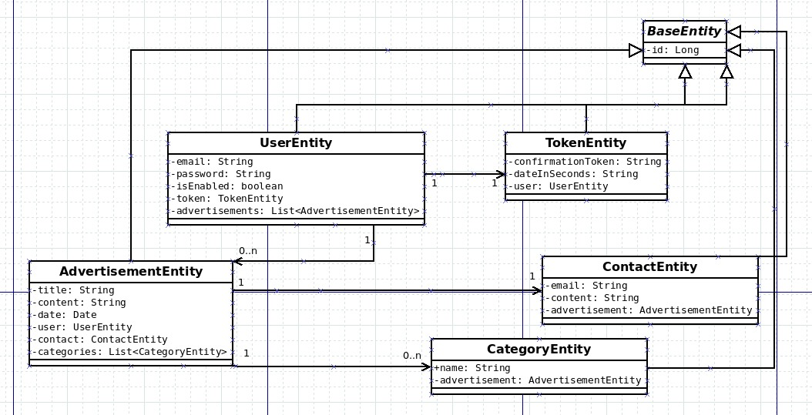

# LET'S WORK

   <h1>WYMAGANIA FUNKCJONALNE</h1>
<ul>
   <li>umożliwienie stworzenia konta użytkownika</li>
   <li>autoryzacja użytkownika</li>
   <li>wylogowywanie</li>
   <li>umożliwienie użytkownikowi dodawania i usuwania ogłoszeń</li>
   <li>wyświetlanie ogłoszeń na tablicy</li>
   <li>filtrowanie ogłoszeń</li>
   <li>umożliwienie kontaktu użytkownika z przyszłym pracodawcą</li>
   <li>zarządzanie kontem użytkownika</li>
</ul>

   <h1>WYMAGANIA NIEFUNKCJONALNE</h1>
<ul>
   <li>intuicyjny i prosty w obsłudze</li>
   <li>wydajny</li>
   <li>interfejsem jest strona www - jest to aplikacja webowa</li>
   <li>strona jest przeznaczona dla grupy użytkowników - poszukujących pracy i pracodawców</li>
   <li>aplikacja będzie działać na każdym urządzeniu, które posiada przeglądarkę</li>
   <li>aplikacja nie wymaga żadnych dodatkowych wymagań dotyczących sprzętu i oprogramowania</li>
</ul>

   <h1>WYMAGANIA UŻYTKOWNIKA </h1>
<ul>
   <li>strona ma być łatwa w obsłudze i intuicyjna</li>
   <li>strona ma być czytelna i przejrzysta</li>
   <li>interfejsem jest strona www - jest to aplikacja webowa</li>
   <li>strona ma umożliwiać komunikację pracodawców z osobami poszukującymi pracy</li>
   <li>strona ma działać na wielu urządzeniach</li>
   <li>strona ma zawierac możliwość filtrowania ogłoszeń</li>
</ul>

   <h1>WYMAGANIA SYSTEMOWE </h1>
<ul>
   <li>Zostaną wykorzytane techniki UI/UX ułatwiające komunikację użytkownika ze stroną</li>
   <li>zostaną wykorzystane fonty i kolory zalecane przez projektantów stron</li>
   <li>zostanie stworzony formularz kontaktowy e-mail</li>
   <li>strona ma być responsywna</li>
   <li>strona będzie zawierać rozwijaną listę z checkboxami umożliwiajacymi filtrowanie ogłoszeń</li>
</ul>

   <h1>MODEL PRZYROSTOWY</h1>
<ul>
   <li>możliwość łatwiejszego dopasowywania się do ewentualnych zmian w specyfikacji</li>
   <li>po zakończeniu każdego z etapów mamy działający (choć pozbawiony części funkcjonalności) produkt</li>
</ul>
   
<h1>Diagram UML</h1> 

